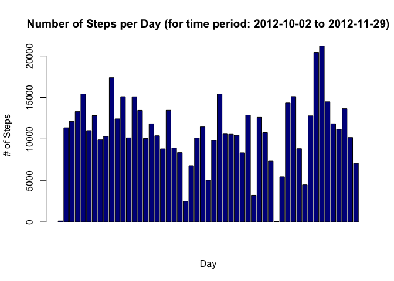
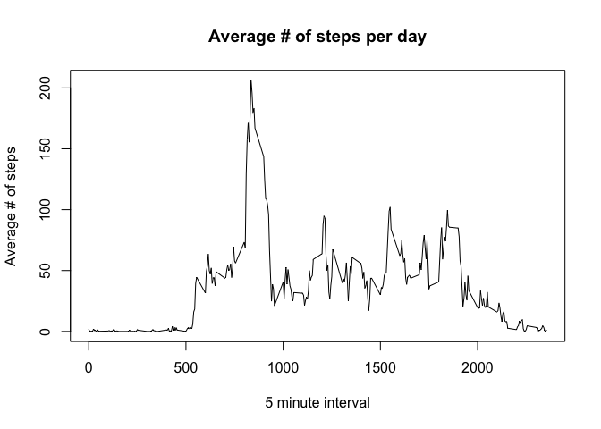
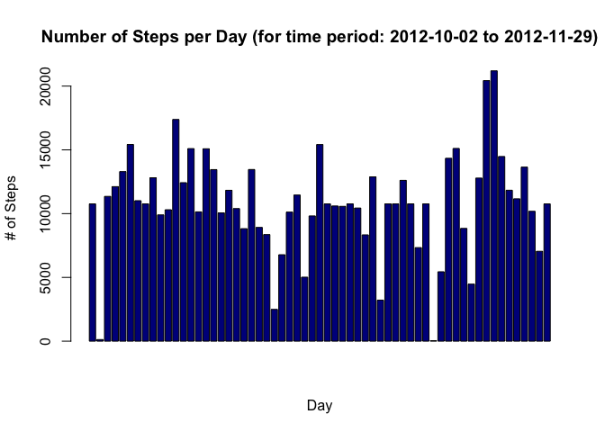
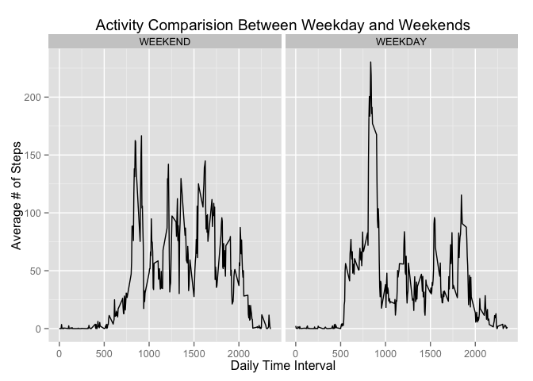

# Reproducible Research: Peer Assessment 1

## Loading and preprocessing the data

```r
activity <- read.csv("activity.csv",stringsAsFactors = FALSE,na.strings="NA")
activity$date <- as.Date(activity$date,format="%Y-%m-%d")
```

Create a "clean" dataset for some of the analysis

```r
activity_clean <- na.omit(activity)
```
## What is mean total number of steps taken per day?

* Build an aggregate of the data, # of steps by day.

```r
activity_agg <- aggregate(.~date,data=activity_clean,sum)
```

* Show a histogram of the total number of steps per day

```r
barplot(activity_agg$steps,
        main="Number of Steps per Day (for time period: 2012-10-02 to 2012-11-29)",
        col=c("darkblue"),
        xlab="Day",
        ylab="# of Steps"
)
```

 

* Calculate the mean and median for total number of steps taken per day

```r
summary(activity_agg$steps)
```

```
##    Min. 1st Qu.  Median    Mean 3rd Qu.    Max. 
##      41    8841   10760   10770   13290   21190
```
From the output above, it appears that the mean # of steps taken per day is **10770** and the median is **10760**.

## What is the average daily activity pattern?
* Graph the average number of steps per day

```r
agg_steps <- aggregate(.~interval,data=activity_clean,mean)
plot(agg_steps$interval, agg_steps$steps,type="l", xlab="5 minute interval", ylab="Average # of steps", main="Average # of steps per day")
```

 

* Determine which five minute interval in the dataset has the maximum number of steps

```r
subset(agg_steps,agg_steps$steps == max(agg_steps$steps))
```

```
##     interval    steps     date
## 104      835 206.1698 15643.72
```
From the output above it, looks like interval **835** has the most number of steps (**206**) on average, across all days in the dataset.

## Imputing missing values
* Determine the total number of missing values in the dataset (step 1)

```r
str(activity)
```

```
## 'data.frame':	17568 obs. of  3 variables:
##  $ steps   : int  NA NA NA NA NA NA NA NA NA NA ...
##  $ date    : Date, format: "2012-10-01" "2012-10-01" ...
##  $ interval: int  0 5 10 15 20 25 30 35 40 45 ...
```

```r
summary(activity)
```

```
##      steps             date               interval     
##  Min.   :  0.00   Min.   :2012-10-01   Min.   :   0.0  
##  1st Qu.:  0.00   1st Qu.:2012-10-16   1st Qu.: 588.8  
##  Median :  0.00   Median :2012-10-31   Median :1177.5  
##  Mean   : 37.38   Mean   :2012-10-31   Mean   :1177.5  
##  3rd Qu.: 12.00   3rd Qu.:2012-11-15   3rd Qu.:1766.2  
##  Max.   :806.00   Max.   :2012-11-30   Max.   :2355.0  
##  NA's   :2304
```
The total number of missing values is **2304** out of **17568** observations.

* Fill in the missing values using the mean for that 5-minute interval (step 2,3).

```r
missing_activity <- subset(activity,is.na(activity$steps) == TRUE)
ave_steps <- agg_steps
ave_steps$steps <- round(ave_steps$steps)

# Use the mean of a given 5-minute interval for the estimation stratagy
merged_missing <- merge(missing_activity,ave_steps, by="interval")
col <- c("steps.y","date.x","interval")
nice_merged <- merged_missing[col]
colnames(nice_merged) <- c("steps","date","interval")
activity_ave <- rbind(nice_merged,activity_clean)

# Show some stats for the newly created dataframe 
str(activity_ave)
```

```
## 'data.frame':	17568 obs. of  3 variables:
##  $ steps   : num  2 2 2 2 2 2 2 2 0 0 ...
##  $ date    : Date, format: "2012-10-01" "2012-11-30" ...
##  $ interval: int  0 0 0 0 0 0 0 0 5 5 ...
```

* Recompute the aggregate of the data, # of steps by day.

```r
agg_activity_ave <- aggregate(.~date,data=activity_ave,sum)
```

* Show a histogram of the total number of steps per day

```r
barplot(agg_activity_ave$steps,
        main="Number of Steps per Day (for time period: 2012-10-02 to 2012-11-29)",
        col=c("darkblue"),
        xlab="Day",
        ylab="# of Steps"
)
```

 

* Recompute the mean and median for total number of steps taken per day

```r
summary(agg_activity_ave$steps)
```

```
##    Min. 1st Qu.  Median    Mean 3rd Qu.    Max. 
##      41    9819   10760   10770   12810   21190
```

```r
summary(activity_agg$steps)
```

```
##    Min. 1st Qu.  Median    Mean 3rd Qu.    Max. 
##      41    8841   10760   10770   13290   21190
```
Looking at the summary statistics output above, estimating the missing values has a slight impact on the analysis.  The mean and the median stayed the same, however there were differences in both the 1st quantile: 9819 steps with the estimated data and 8841 without and in the 3rd quantile: 12810 steps with the estimated data and 13290 without.

## Are there differences in activity patterns between weekdays and weekends?


```r
activity_ave["w"] <- NA
activity_ave$w <- ifelse(as.POSIXlt(activity_ave$date)$wday > 0 & as.POSIXlt(activity_ave$date)$wday < 6,"WEEKDAY", "WEEKEND")
activity_ave$w <- factor(activity_ave$w)

weekends1 <- subset(activity_ave, activity_ave$w == "WEEKEND")
weekdays1 <- subset(activity_ave, activity_ave$w == "WEEKDAY")

agg_weekend_steps <- aggregate(.~interval,data=weekends1,mean)
agg_weekday_steps <- aggregate(.~interval,data=weekdays1,mean)

# After aggregation, re-assemble data frame for panel plot
agg_weekday_steps$w <- factor("WEEKDAY")
agg_weekend_steps$w <- factor("WEEKEND")
re_merge <- rbind(agg_weekend_steps,agg_weekday_steps)
```


```r
# Now do the plot
library(ggplot2)
```

```
## Warning: package 'ggplot2' was built under R version 3.1.3
```

```r
ggplot(re_merge, aes(x = interval, y = steps)) + geom_line() + facet_wrap( ~ w) + ggtitle("Activity Comparision Between Weekday and Weekends") + ylab("Average # of Steps") + xlab("Daily Time Interval")
```

 


